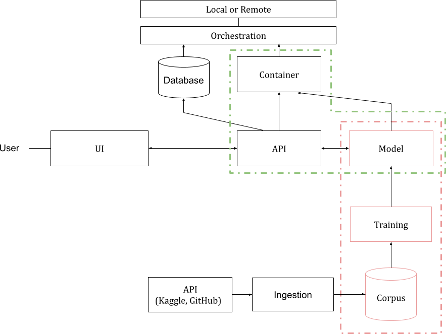

# **Building an API for Machine Learning Models**

## **Introduction**
This project focuses on developing a machine learning model and deploying it as an API using FastAPI. The pipeline includes data ingestion, preprocessing, model training, deployment, and monitoring. The API will be containerized with Docker for easy deployment.

## **Workflow Architecture**


---

## **1. Building a Machine Learning Model with scikit-learn**

### **Dataset Preparation**
- **Download or Design a Dataset**: We download a ZIP dataset from Kaggle ([Language Identification Dataset](https://www.kaggle.com/datasets/lailaboullous/language-detection-dataset)) and process it for training. The detailed steps are available in `training.ipynb`.

### **Data Ingestion**
- **Batch Ingestion**: Download and clean raw data.
- **Stream Ingestion**: Refer to Big Data lectures on Spark and Kafka to design your dataset for both training and inference stages.

### **Training and Setting Up the Complete Pipeline**
- **Preprocessing**: Prepare the data for the machine learning algorithm.
- **Training**: Fit the model with the processed dataset.
- **Inference Pipeline**: Ensure easy deployment and integration with the API.

---

## **2. Setting Up an API with FastAPI**
FastAPI is used to serve the trained model as an API.

### **Installation**
```bash
pip install fastapi uvicorn
```

### **Running the API Locally**
```bash
uvicorn main:app --host 0.0.0.0 --port 5000
```

### **Testing the API**
```bash
curl -X POST "http://localhost:5000/predict" -H "Content-Type: application/json" -d '{"text": "Hello, world!"}'
```

---

## **3. Dockerization**
To containerize the API, we use Docker.

### **Dockerfile**
```Dockerfile
FROM tiangolo/uvicorn-gunicorn-fastapi:python3.9

COPY ./requirements.txt /app/requirements.txt

RUN pip install --no-cache-dir --upgrade -r /app/requirements.txt

COPY ./app /app/app
```

### **Building and Running the Docker Container**
```bash
docker build -t ml_api .
docker run -p 5000:5000 ml_api
```

---

## **4. Monitoring & Deployment**
- **MLflow**: Track experiments and model versions.
- **Prometheus & Grafana**: Monitor API performance.
- **Kubernetes/Minikube**: Deploy at scale.

### **Future Improvements**
- Implement a CI/CD pipeline.
- Optimize model performance.
- Automate deployment.


